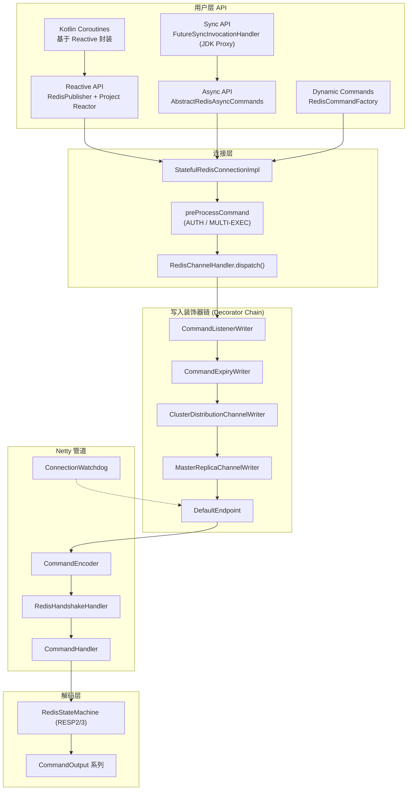

# Lettuce 项目架构深度分析

> 基于源码版本 **7.6.0-SNAPSHOT** 梳理  
> 项目地址：[https://github.com/redis/lettuce](https://github.com/redis/lettuce)

---

## 目录

1. [项目概述](#1-项目概述)
2. [整体架构](#2-整体架构)
3. [模块与包结构](#3-模块与包结构)
4. [核心实现原理](#4-核心实现原理)
5. [使用示例](#5-使用示例)
6. [设计亮点](#6-设计亮点)
7. [技术亮点](#7-技术亮点)
8. [依赖与技术栈](#8-依赖与技术栈)
9. [总结](#9-总结)

---

## 1. 项目概述

**Lettuce** 是一个面向 Java 的高级 Redis 客户端，由 Redis 官方维护（MIT 协议）。其核心定位是：

- **线程安全**：多线程可共享同一连接（需避免阻塞命令与事务）
- **多编程模型**：同步（Sync）、异步（Async）、响应式（Reactive）、Kotlin 协程
- **全场景部署**：Standalone、Sentinel、Cluster、主从读写分离
- **基于 Netty**：非阻塞 I/O，高性能网络栈
- **功能完备**：SSL、Unix Domain Socket、Pipeline、自动重连、Codec、RediSearch/RedisJSON/Vector Sets 等

与 Jedis 等传统客户端的关键差异：Lettuce 从设计上就是 **异步优先** 的——同步 API 只是对异步 API 的薄封装，所有命令最终走同一条 Netty 管道。

---

## 2. 整体架构

### 2.1 分层架构图



### 2.2 核心对象关系

| 层级 | 核心类 | 职责 |
|------|--------|------|
| 客户端 | `RedisClient` / `RedisClusterClient` | 管理 `ClientResources`、创建连接 |
| 连接 | `StatefulRedisConnectionImpl` | 持有 Codec、Sync/Async/Reactive 入口 |
| 调度 | `RedisChannelHandler` | `dispatch()` 将命令交给 Writer |
| 写入 | `DefaultEndpoint` | 缓冲、重连回放、Push 消息 |
| 网络 | `CommandHandler` | Netty 双工处理器，命令栈 + 解码 |
| 协议 | `RedisStateMachine` | RESP2/RESP3 增量解析 |
| 命令 | `Command` + `CommandArgs` + `CommandOutput` | 编码 / 解码三位一体 |

### 2.3 客户端类型矩阵

| 场景 | 入口类 | 连接类型 |
|------|--------|----------|
| 单机 | `RedisClient` | `StatefulRedisConnection` |
| 集群 | `RedisClusterClient` | `StatefulRedisClusterConnection` |
| 主从 / Sentinel | `MasterReplica.connect()` | `StatefulRedisMasterReplicaConnection` |
| Pub/Sub | `RedisClient.connectPubSub()` | `StatefulRedisPubSubConnection` |
| 多库 Failover (Beta) | `MultiDbClient` | `StatefulRedisMultiDbConnection` |

---

## 3. 模块与包结构

```
src/main/
├── java/io/lettuce/core/
│   ├── (root)                    # 客户端、连接、命令构建、Publisher
│   ├── api/                      # sync / async / reactive 公开接口
│   ├── protocol/                 # Netty 管道、RESP、重连
│   ├── output/                   # 各命令的 RESP 解码器
│   ├── codec/                    # 序列化/反序列化
│   ├── cluster/                  # 集群路由、拓扑、MOVED/ASK
│   ├── pubsub/                   # 发布订阅专用 Handler/Endpoint
│   ├── masterreplica/            # 主从 + Sentinel 读写分离
│   ├── sentinel/                 # Sentinel 专用 API
│   ├── dynamic/                  # 用户自定义命令接口
│   ├── support/                  # 连接池、客户端缓存
│   ├── resource/                 # EventLoop、Timer、DNS
│   ├── event/                    # 事件总线、JFR 事件
│   ├── metrics/                  # 命令延迟采集
│   ├── tracing/                  # OpenTelemetry / Brave
│   ├── failover/                 # 多库自动切换 (Beta)
│   ├── json/                     # RedisJSON 参数与类型
│   ├── search/                   # RediSearch 参数与类型
│   ├── vector/                   # Vector Sets
│   └── internal/                 # 内部工具类
├── kotlin/io/lettuce/core/
│   └── api/coroutines/           # Kotlin 协程 API（由代码生成器产出）
└── templates/io/lettuce/core/api/  # API 模板（单一事实来源）
```

### 3.1 各包职责详解

#### `protocol` — 协议与网络核心

- **`CommandHandler`**：Netty `ChannelDuplexHandler`，维护命令栈（`HashIndexedQueue`），读响应、写命令、处理 Push 消息与背压
- **`CommandEncoder`**：`MessageToByteEncoder`，调用 `Command.encode(ByteBuf)` 写 RESP
- **`DefaultEndpoint`**：实现 `RedisChannelWriter` + `Endpoint`，断连时缓冲命令，重连后回放
- **`RedisStateMachine`**：RESP2/RESP3 状态机，按字节标记（`+`, `-`, `:`, `$`, `*`, 及 RESP3 扩展）驱动 `CommandOutput`
- **`ConnectionWatchdog`**：指数退避重连
- **`RedisHandshakeHandler`**：连接建立时的 AUTH / HELLO / SELECT 握手

#### `output` — 响应解码

每种 Redis 返回类型对应一个 `CommandOutput` 子类，例如：

- `ValueOutput` — 单值
- `KeyValueListOutput` — MGET 等
- `ScoredValueListOutput` — ZRANGE WITHSCORES
- `StreamingOutput` — 流式解码（SCAN、KEYS 等大数据集）

#### `cluster` — 集群

- **`ClusterDistributionChannelWriter`**：根据 Key 的 CRC16 Slot 选择节点
- **`ClusterCommand`**：包装命令，处理 MOVED/ASK 重定向
- **`SlotHash`**：16384 Slot + Hash Tag `{...}` 支持
- **`ClusterTopologyRefresh`**：周期性 / 自适应拓扑刷新

#### `dynamic` — 动态命令接口

用户定义 Java 接口 + 注解，运行时生成 Proxy，无需手写 400+ 命令实现。

---

## 4. 核心实现原理

### 4.1 命令执行全链路

以一次 `async.set("key", "value")` 为例：

```
1. RedisAsyncCommandsImpl.set()
      ↓
2. dispatch(redisCommandBuilder.set(key, value))
      ↓  创建 Command + ValueOutput + CommandArgs
3. 包装为 AsyncCommand (CompletableFuture + RedisFuture)
      ↓
4. StatefulRedisConnectionImpl.dispatch(asyncCommand)
      ↓  preProcessCommand (事务状态检查等)
5. RedisChannelHandler.dispatch(cmd)
      ↓  可选 TracedCommand 包装
6. RedisChannelWriter.write(cmd)  [装饰器链]
      ↓
7. DefaultEndpoint.write(cmd)
      ↓  若 channel 未激活 → disconnectedBuffer
8. channel.write(cmd) → CommandEncoder.encode()
      ↓  RESP: *3\r\n$3\r\nSET\r\n...
9. CommandHandler.write() → 命令入栈
      ↓
10. 网络发送 → Redis Server
      ↓
11. CommandHandler.channelRead() → RedisStateMachine.decode()
      ↓
12. ValueOutput 填充结果 → AsyncCommand.complete("OK")
      ↓
13. RedisFuture.get() / thenAccept() 获得结果
```

**关键代码 — dispatch 入口：**

```java
// RedisChannelHandler.java
protected <T> RedisCommand<K, V, T> dispatch(RedisCommand<K, V, T> cmd) {
    if (tracingEnabled) {
        // 可选分布式追踪包装
        return channelWriter.write(new TracedCommand<>(cmd, traceContext));
    }
    return channelWriter.write(cmd);
}
```

### 4.2 同步 API 的实现 — Proxy + Future 阻塞

Lettuce **不为 Sync API 单独实现 400+ 方法**，而是通过 JDK 动态代理：

```java
// FutureSyncInvocationHandler.java
protected Object handleInvocation(Object proxy, Method method, Object[] args) {
    Method targetMethod = this.translator.get(method);
    Object result = targetMethod.invoke(asyncApi, args);

    if (result instanceof RedisFuture<?>) {
        RedisFuture<?> command = (RedisFuture<?>) result;
        long timeout = getTimeoutNs(command);
        return Futures.awaitOrCancel(command, timeout, TimeUnit.NANOSECONDS);
    }
    return result;
}
```

**设计收益**：
- Sync / Async / Reactive 共享同一套命令构建逻辑（`RedisCommandBuilder`）
- 新增 Redis 命令只需维护 Async 实现 + 模板，Sync/Reactive 自动生成

### 4.3 响应式 API — RedisPublisher

`RedisPublisher` 实现 Reactive Streams `Publisher` 接口，是 Reactive API 的核心：

- 订阅时调用 `connection.dispatch(command)`
- 支持 **StreamingOutput**：SCAN 等命令边解码边 emit 元素
- 支持 **dissolve**：将 Collection 拆成多个元素逐个推送
- 使用 `ClientResources` 的计算线程池调度信号
- 实现 `DemandAware` 背压协议

```java
// AbstractRedisReactiveCommands 典型模式
protected <T> Mono<T> createMono(Supplier<RedisCommand<K, V, T>> commandSupplier) {
    return Mono.from(new RedisPublisher<>(commandSupplier, connection, false, getScheduler()));
}
```

### 4.4 RESP 协议编解码

#### 编码（出站）

`Command.encode()` 生成 RESP 数组：

```
*3\r\n          ← 参数个数
$3\r\nSET\r\n   ← 命令名
$3\r\nkey\r\n    ← Key (经 RedisCodec 编码)
$5\r\nvalue\r\n  ← Value
```

#### 解码（入站）

`RedisStateMachine` 使用 **增量状态机** 解析：

- 通过 `TYPE_BY_BYTE_MARKER` 数组 O(1) 识别 RESP 类型
- 支持 RESP2 全部类型 + RESP3 扩展（`map`, `set`, `push`, `verbatim string` 等）
- 解析结果写入当前命令的 `CommandOutput`

### 4.5 Netty 管道组装

`ConnectionBuilder.buildHandlers()` 按序装配：

```
ChannelGroupListener
  → CommandEncoder
  → RedisHandshakeHandler
  → CommandHandler (或 PubSubCommandHandler)
  → ConnectionEventTrigger
  → ConnectionWatchdog (若 autoReconnect=true)
```

传输层自动选择最优 Native Transport：

- Linux: Epoll / io_uring
- macOS: KQueue
- 通用: NIO

### 4.6 自动重连与命令回放

`DefaultEndpoint` 的可靠性模型：

| 状态 | 行为 |
|------|------|
| 连接正常 | 命令直接 `channel.write()` |
| 连接断开 + `AT_LEAST_ONCE` | 命令进入 `disconnectedBuffer` |
| 重连成功 | `flushCommands()` 回放缓冲命令 |
| `DisconnectedBehavior.REJECT` | 断连期间直接拒绝新命令 |

`ConnectionWatchdog` 使用 `Delay`（指数退避）在 `HashedWheelTimer` 上调度重连。

### 4.7 集群路由原理

```
命令到达 ClusterDistributionChannelWriter
  ↓
提取第一个 Key → SlotHash.getSlot(key) → CRC16 % 16384
  ↓
查 Partitions 找到负责 Slot 的 RedisClusterNode
  ↓
ClusterConnectionProvider 获取/创建到该节点的连接
  ↓
写入目标节点
  ↓
若返回 MOVED/ASK → ClusterCommand 自动重试 (maxRedirects 次)
```

**ReadFrom** 策略（集群 / 主从通用）：

- `UPSTREAM` / `MASTER` — 只读主
- `REPLICA_PREFERRED` — 优先从库
- `LOWEST_LATENCY` — 选延迟最低的节点
- `ANY` — 任意节点

### 4.8 Codec 系统

```java
public interface RedisCodec<K, V> {
    ByteBuffer encodeKey(K key);
    ByteBuffer decodeKey(ByteBuffer bytes);
    ByteBuffer encodeValue(V value);
    ByteBuffer decodeValue(ByteBuffer bytes);
}
```

内置实现：

| Codec | 用途 |
|-------|------|
| `StringCodec` | UTF-8 字符串（默认） |
| `ByteArrayCodec` | 二进制 |
| `CompressionCodec` | 压缩包装 |
| `CipherCodec` | 加密包装 |
| `ComposedRedisCodec` | Key/Value 分别指定 Codec |

`ToByteBufEncoder` 接口允许 Codec 直接写入 Netty `ByteBuf`，避免中间 `ByteBuffer` 拷贝。

### 4.9 API 代码生成机制

Lettuce 维护 **单一模板源**（`src/main/templates/`），通过 JavaParser 自动生成多套 API：

| 生成器 | 输入 | 输出 |
|--------|------|------|
| `CreateAsyncApi` | `RedisStringCommands.java` 模板 | `RedisStringAsyncCommands.java` |
| `CreateReactiveApi` | 同上 | `RedisStringReactiveCommands.java` |
| `CreateKotlinCoroutinesApi` | 同上 | `RedisStringCoroutinesCommands.kt` |
| `CreateSyncNodeSelectionClusterApi` | 模板 | 集群 NodeSelection API |

模板中使用 `${intent}` 占位符，生成时替换为 "Asynchronous executed commands" 等描述。

**Sync API 不生成实现类**，而是通过 `FutureSyncInvocationHandler` 代理 Async API。

### 4.10 Pub/Sub 特殊处理

Pub/Sub 模式下 Redis 会在命令响应之间 **穿插推送消息**，Lettuce 专门处理：

- **`PubSubCommandHandler`** 继承 `CommandHandler`，检测消息交错
- **`PubSubOutput`** 解码 message/pmessage/smessage 等
- **`PubSubEndpoint`** 限制订阅状态下的允许命令（subscribe/unsubscribe/ping/quit）
- 用户通过 `RedisPubSubListener` 回调接收消息

### 4.11 动态命令接口

```java
public interface MyCommands extends Commands {
    String get(String key);                          // Sync
    RedisFuture<String> set(String key, String val); // Async
    @Command("SET")
    Mono<String> setReactive(String key, String val, SetArgs args); // Reactive
}

MyCommands cmds = new RedisCommandFactory(connection).getCommands(MyCommands.class);
```

运行时流程：

1. `InvocationProxyFactory` 创建 JDK Proxy
2. `ExecutableCommandLookupStrategy` 解析方法签名 → `CommandMethod`
3. 参数绑定（`ParameterBinder`）、输出类型解析（`OutputRegistry`）
4. 最终调用 `connection.dispatch()`

返回类型决定执行模式：`String` → Sync，`RedisFuture` → Async，`Mono`/`Flux` → Reactive。

---

## 5. 使用示例

### 5.1 基础连接（Standalone）

```java
// 语法: redis://[username:password@]host[:port][/databaseNumber]
RedisClient redisClient = RedisClient.create("redis://password@localhost:6379/0");
StatefulRedisConnection<String, String> connection = redisClient.connect();

System.out.println("Connected to Redis");

connection.close();
redisClient.shutdown();
```

> 来源：`src/test/java/io/lettuce/examples/ConnectToRedis.java`

### 5.2 同步读写

```java
RedisClient redisClient = RedisClient.create(RedisURI.create("redis://password@localhost:6379/0"));
StatefulRedisConnection<String, String> connection = redisClient.connect();

RedisCommands<String, String> sync = connection.sync();
sync.set("foo", "bar");
String value = sync.get("foo");  // "bar"

connection.close();
redisClient.shutdown();
```

### 5.3 异步 API（CompletableFuture 链式）

```java
RedisClient redisClient = RedisClient.create("redis://localhost:6379");

try (StatefulRedisConnection<String, String> connection = redisClient.connect()) {
    RedisAsyncCommands<String, String> async = connection.async();

    // SET + GET 链式
    async.set("bike:1", "Deimos")
        .thenCompose(v -> async.get("bike:1"))
        .thenAccept(System.out::println);  // Deimos

    // SET NX / XX
    async.setnx("bike:1", "bike");  // false (key 已存在)
    async.set("bike:1", "bike", SetArgs.Builder.xx());  // OK

    // MSET / MGET
    Map<String, String> bikes = Map.of(
        "bike:1", "Deimos", "bike:2", "Ares", "bike:3", "Vanth");
    async.mset(bikes)
        .thenCompose(v -> async.mget("bike:1", "bike:2", "bike:3"))
        .thenAccept(System.out::println);

    // INCR / INCRBY
    async.set("total_crashes", "0")
        .thenCompose(v -> async.incr("total_crashes"))       // 1
        .thenCompose(v -> async.incrby("total_crashes", 10)) // 11
        .thenAccept(System.out::println);
}
```

> 来源：`src/test/java/io/redis/examples/async/StringExample.java`

### 5.4 响应式 API（Project Reactor）

```java
RedisClient redisClient = RedisClient.create("redis://localhost:6379");

try (StatefulRedisConnection<String, String> connection = redisClient.connect()) {
    RedisReactiveCommands<String, String> reactive = connection.reactive();

    reactive.set("bike:1", "Deimos")
        .flatMap(v -> reactive.get("bike:1"))
        .doOnNext(System.out::println)  // Deimos
        .block();

    reactive.set("bike:1", "bike", SetArgs.Builder.xx())
        .doOnNext(System.out::println)  // OK
        .subscribe();
}
```

> 来源：`src/test/java/io/redis/examples/reactive/StringExample.java`

### 5.5 Redis Cluster

```java
RedisClusterClient clusterClient = RedisClusterClient.create("redis://password@localhost:7379");
StatefulRedisClusterConnection<String, String> connection = clusterClient.connect();

// 用法与 Standalone 几乎一致，路由由客户端透明处理
connection.sync().set("key", "value");

connection.close();
clusterClient.shutdown();
```

### 5.6 Cluster 拓扑自动刷新

```java
RedisClusterClient clusterClient = RedisClusterClient.create("redis://password@localhost:7379");

ClusterTopologyRefreshOptions refreshOptions = ClusterTopologyRefreshOptions.builder()
    .enablePeriodicRefresh(30, TimeUnit.MINUTES)
    .enableAllAdaptiveRefreshTriggers()  // MOVED/ASK/PERSISTENT 触发刷新
    .build();

ClusterClientOptions options = ClusterClientOptions.builder()
    .topologyRefreshOptions(refreshOptions)
    .build();

clusterClient.setOptions(options);
StatefulRedisClusterConnection<String, String> connection = clusterClient.connect();
```

> 来源：`src/test/java/io/lettuce/examples/ConnectToRedisClusterWithTopologyRefreshing.java`

### 5.7 Sentinel 主从 + 读写分离

```java
RedisClient redisClient = RedisClient.create();

// 语法: redis-sentinel://[password@]host[:port][,...]/db#masterId
StatefulRedisMasterReplicaConnection<String, String> connection =
    MasterReplica.connect(redisClient, StringCodec.UTF8,
        RedisURI.create("redis-sentinel://localhost:26379,localhost:26380/0#mymaster"));

connection.setReadFrom(ReadFrom.UPSTREAM_PREFERRED);  // 优先读主，主不可用时读从

connection.close();
redisClient.shutdown();
```

> 来源：`src/test/java/io/lettuce/examples/ConnectToMasterSlaveUsingRedisSentinel.java`

### 5.8 Pub/Sub

```java
RedisClient client = RedisClient.create("redis://localhost:6379");
StatefulRedisPubSubConnection<String, String> connection = client.connectPubSub();

connection.addListener(new RedisPubSubAdapter<>() {
    @Override
    public void message(String channel, String message) {
        System.out.println(channel + ": " + message);
    }
});

connection.sync().subscribe("news");

// ... 保持连接 ...
```

### 5.9 连接池

```java
// 适用于阻塞命令 (BLPOP)、事务 (MULTI/EXEC)、Pipeline 等需要独占连接的场景
GenericObjectPool<StatefulRedisConnection<String, String>> pool =
    ConnectionPoolSupport.createGenericObjectPool(
        () -> redisClient.connect(), new GenericObjectPoolConfig<>());

try (StatefulRedisConnection<String, String> conn = pool.borrowObject()) {
    conn.sync().blpop(30, "queue");
}
// close() 自动归还连接池

pool.close();
redisClient.shutdown();
```

### 5.10 Kotlin 协程

```kotlin
val connection = redisClient.connect<String, String>()
val commands = connection.coroutines()

// suspend 函数，底层 await Reactive Mono
val value = commands.get("key")
commands.set("key", "value")
```

> 实现：`RedisCoroutinesCommandsImpl` 委托给 `RedisReactiveCommands`，使用 `awaitFirstOrNull()` 挂起。

### 5.11 Pipeline / 批量刷新

```java
connection.setAutoFlushCommands(false);  // 关闭自动 flush
async.set("k1", "v1");
async.set("k2", "v2");
async.set("k3", "v3");
connection.flushCommands();              // 一次性发送
connection.setAutoFlushCommands(true);   // 恢复
```

### 5.12 自定义 Codec

```java
RedisCodec<String, MyObject> codec = RedisCodec.of(
    StringCodec.UTF8,
    new MyObjectCodec()  // 自定义 JSON/Protobuf 编解码
);
StatefulRedisConnection<String, MyObject> connection = redisClient.connect(codec);
```

---

## 6. 设计亮点

### 6.1 异步优先，同步是语法糖

所有编程模型共享 **同一套命令对象和网络管道**。Sync API 通过 Proxy 代理 Async API，避免了三套独立实现带来的维护负担和语义不一致风险。

### 6.2 装饰器链式 Writer

`RedisChannelWriter` 可被多层包装，每层只关注单一横切关注点：

```
DefaultEndpoint
  ← CommandExpiryWriter      (超时)
  ← CommandListenerWriter    (监听器)
  ← ClusterDistributionChannelWriter  (路由)
  ← MasterReplicaChannelWriter        (读写分离)
```

新增功能（如追踪、限流）只需添加 Decorator，无需修改核心逻辑。

### 6.3 模板驱动的 API 生成

400+ Redis 命令的 Sync/Async/Reactive/Coroutines 四套 API 从 **20 个模板文件** 自动生成。新增命令时：

1. 在 `RedisCommandBuilder` 添加构建方法
2. 在 `AbstractRedisAsyncCommands` 添加 dispatch 方法
3. 在模板接口添加方法签名
4. 运行 API Generator 重新生成

### 6.4 连接共享 vs 连接池

Lettuce 明确区分两种模式：

- **默认**：连接线程安全，多线程共享，零池化开销
- **池化**：仅在需要连接状态隔离时（阻塞命令、事务、Pipeline）使用

这避免了不必要的连接池开销，同时保留了池化能力。

### 6.5 Command / Output / Args 三件套

每个 Redis 命令由三个对象协作：

| 组件 | 职责 | 示例 |
|------|------|------|
| `Command` + `CommandArgs` | 编码请求 | `SET key value EX 60` |
| `CommandOutput` | 解码响应 | `ValueOutput` → `String` |
| `AsyncCommand` | 异步生命周期 | `CompletableFuture` 包装 |

Output 类型与命令一一对应，类型安全且可扩展。

### 6.6 断连缓冲 + 至少一次语义

`DefaultEndpoint` 在 `AT_LEAST_ONCE` 模式下断连不丢命令，重连后自动回放。配合 `ConnectionWatchdog` 的指数退避，实现了生产级的连接弹性。

### 6.7 集群 MOVED/ASK 透明重试

`ClusterCommand` 将重定向逻辑封装在命令完成回调中，用户代码无感知：

```java
connection.sync().get("key");  // 可能触发 MOVED → 自动重路由 → 返回结果
```

### 6.8 动态命令接口

允许用户以 **声明式** 方式扩展 API，特别适合：

- Redis Modules 自定义命令
- 内部 DSL 封装
- 减少样板代码

### 6.9 资源生命周期清晰

```
ClientResources (共享, 昂贵)
  └── RedisClient / RedisClusterClient (可多个)
        └── StatefulRedisConnection (可多个)
              └── Sync / Async / Reactive API (轻量引用)
```

`ClientResources` 管理 EventLoopGroup、Timer、DNS 等重量级资源，应在应用级别共享。

---

## 7. 技术亮点

### 7.1 Netty 深度集成

- 自定义 `ChannelDuplexHandler`（`CommandHandler`）而非简单使用 Netty Redis 编解码器
- 支持 Epoll / io_uring / KQueue Native Transport
- `ByteBuf` 池化与 `DecodeBufferPolicy` 控制内存
- `Recycler` 对象池减少 GC 压力

### 7.2 RESP3 完整支持

- 协议发现（HELLO 命令协商 RESP 版本）
- Push 消息（`PushHandler` / `PushListener`）
- Map、Set、Double、BigNumber、Verbatim String 等新类型
- Client-side Caching 支持（`support/caching/`）

### 7.3 背压与流式 API

- `RedisPublisher` 实现 Reactive Streams 规范
- `DemandAware` 协议协调生产者/消费者
- `StreamingOutput` 支持 SCAN 等大数据集的增量 emit
- 通过 TCK 测试验证 Reactive Streams 合规性

### 7.4 可观测性

| 能力 | 实现 |
|------|------|
| 命令延迟 | `CommandLatencyRecorder` + HDR Histogram |
| 分布式追踪 | Brave / Micrometer Tracing 适配 |
| 事件总线 | `EventBus` → 连接/重连/认证/集群事件 |
| JFR 事件 | `JfrReconnectFailedEvent` 等 |
| Micrometer 集成 | 指标导出 |

### 7.5 高级 Redis 特性

- **RediSearch**：完整的 Search/Aggregate/Suggest/SpellCheck API
- **RedisJSON**：JSON.GET/SET/MSET 等
- **Vector Sets**：向量相似度搜索
- **Redis Functions**：Function Load/Call/Delete
- **Streams**：Consumer Group、AutoClaim、Pending 消息
- **ACL**：用户权限管理
- **Transactions**：MULTI/EXEC/WATCH 完整支持

### 7.6 安全与连接

- TLS/SSL + SNI 支持
- mTLS 客户端认证
- Unix Domain Socket
- Token-based 认证（Redis 6+ ACL）
- `RedisCredentialsProvider` 动态凭证

### 7.7 Kotlin 一等公民

- 46 个 Coroutines API 文件
- 通过 `@ExperimentalLettuceCoroutinesApi` 标记实验性
- 基于 Reactive 层 `suspend` 封装，零额外网络开销

### 7.8 MultiDb Failover (Beta)

`MultiDbClient` + `CircuitBreaker` 实现多 Redis 实例间的自动切换：

- 健康检查策略（Ping、LagAware）
- 事件驱动切换（`DatabaseSwitchEvent`）
- 适用于 Active-Standby 场景

### 7.9 性能优化细节

- `HashIndexedQueue`：O(1) 命令栈操作
- `ToByteBufEncoder`：Codec 直写 ByteBuf，减少拷贝
- `ImmediateEventExecutor`：同线程优化
- 命令栈有界队列防止 OOM（`boundedQueues` 配置）
- `BackpressureSource`：写入背压控制

---

## 8. 依赖与技术栈

| 依赖 | 版本 | 用途 |
|------|------|------|
| Netty | 4.2.13.Final | 网络 I/O |
| Project Reactor | 3.6.6 | Reactive API |
| Reactive Streams | 1.0.4 | Publisher 规范 |
| Kotlin | 2.0.0 | Coroutines API |
| kotlinx-coroutines | 1.5.2 | 协程运行时 |
| Apache Commons Pool2 | 2.12.0 | 连接池 |
| SLF4J | 2.0.16 | 日志门面 |
| Micrometer | 1.14.2 | 指标 |
| HDR Histogram | 2.2.2 | 延迟统计 |

**构建工具**：Apache Maven  
**Java 版本**：Java 8+（隐式 JPMS 模块）  
**测试**：JUnit 5 + AssertJ + Awaitility + Docker Compose (Redis 集群/Sentinel)

---

## 9. 总结

Lettuce 是一个 **架构成熟、设计精良** 的 Java Redis 客户端，其核心竞争力在于：

1. **统一的异步内核** — 一套管道支撑 Sync/Async/Reactive/Coroutines 四种编程模型
2. **生产级弹性** — 自动重连、命令回放、集群拓扑刷新、读写分离
3. **极致的可扩展性** — 装饰器 Writer、Codec 体系、动态命令接口、模板化 API 生成
4. **全面的 Redis 生态支持** — Cluster、Sentinel、Modules (Search/JSON/Vector)、RESP3
5. **深度 Netty 优化** — Native Transport、ByteBuf 池化、背压、对象回收

对于 Java 开发者而言，Lettuce 不仅是一个 Redis 客户端，更是学习 **异步网络编程**、**装饰器模式**、**协议状态机**、**Reactive Streams** 的优秀范例。

---

## 附录：关键源码索引

| 主题 | 文件路径 |
|------|----------|
| 客户端入口 | `src/main/java/io/lettuce/core/RedisClient.java` |
| 集群客户端 | `src/main/java/io/lettuce/core/cluster/RedisClusterClient.java` |
| 连接实现 | `src/main/java/io/lettuce/core/StatefulRedisConnectionImpl.java` |
| 命令调度 | `src/main/java/io/lettuce/core/RedisChannelHandler.java` |
| 同步代理 | `src/main/java/io/lettuce/core/FutureSyncInvocationHandler.java` |
| 异步命令 | `src/main/java/io/lettuce/core/AbstractRedisAsyncCommands.java` |
| Reactive 发布 | `src/main/java/io/lettuce/core/RedisPublisher.java` |
| Netty 处理器 | `src/main/java/io/lettuce/core/protocol/CommandHandler.java` |
| RESP 解码 | `src/main/java/io/lettuce/core/protocol/RedisStateMachine.java` |
| 端点/重连 | `src/main/java/io/lettuce/core/protocol/DefaultEndpoint.java` |
| 集群路由 | `src/main/java/io/lettuce/core/cluster/ClusterDistributionChannelWriter.java` |
| 动态命令 | `src/main/java/io/lettuce/core/dynamic/RedisCommandFactory.java` |
| 连接池 | `src/main/java/io/lettuce/core/support/ConnectionPoolSupport.java` |
| 资源管理 | `src/main/java/io/lettuce/core/resource/DefaultClientResources.java` |
| API 模板 | `src/main/templates/io/lettuce/core/api/` |
| API 生成器 | `src/test/java/io/lettuce/apigenerator/` |
| 示例代码 | `src/test/java/io/lettuce/examples/` |
