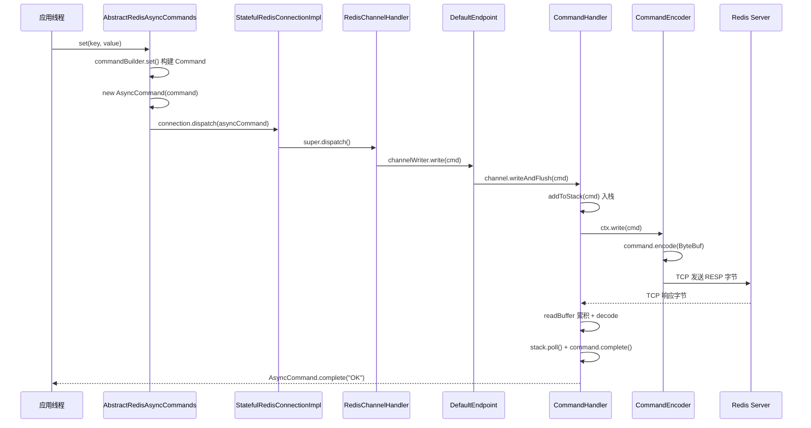

# Lettuce 与 Redis 通信机制 — 源码级深度解析

> 本文以 **7.6.0-SNAPSHOT** 源码为准，以一次典型的 `SET key value` 为主线，串联 **连接建立 → 命令构建 → 写入管道 → TCP 发送 → 响应接收 → RESP 解码 → Future 完成** 全链路。  
> 配套阅读：[LETTUCE_ARCHITECTURE_ANALYSIS.md](./LETTUCE_ARCHITECTURE_ANALYSIS.md)

---

## 目录

1. [总览：通信模型](#1-总览通信模型)
2. [阶段一：TCP 连接与 Netty 管道](#2-阶段一tcp-连接与-netty-管道)
3. [阶段二：连接握手（HELLO / AUTH / SELECT）](#3-阶段二连接握手hello--auth--select)
4. [阶段三：命令对象构建](#4-阶段三命令对象构建)
5. [阶段四：命令下发（dispatch → write）](#5-阶段四命令下发dispatch--write)
6. [阶段五：RESP 编码与出站](#6-阶段五resp-编码与出站)
7. [阶段六：命令栈与顺序保证](#7-阶段六命令栈与顺序保证)
8. [阶段七：入站读取与 RESP 解码](#8-阶段七入站读取与-resp-解码)
9. [阶段八：命令完成与 Future 唤醒](#9-阶段八命令完成与-future-唤醒)
10. [断连、缓冲与重连回放](#10-断连缓冲与重连回放)
11. [Pipeline 与 autoFlush](#11-pipeline-与-autoflush)
12. [关键类速查表](#12-关键类速查表)

---

## 1. 总览：通信模型

Lettuce **不**使用阻塞式 Socket API，而是通过 **Netty NIO** 与 Redis 通信。一次业务调用的数据流如下：



**三个核心不变量**（理解底层原理的关键）：

| 不变量 | 含义 |
|--------|------|
| **一命令一对象** | 每个 Redis 命令对应一个 `RedisCommand`（常为 `AsyncCommand` 包装 `Command`） |
| **栈保序** | `CommandHandler` 用 FIFO 栈保证请求/响应一一对应（非事务下） |
| **编解码分离** | 出站：`Command.encode()`；入站：`RedisStateMachine` + `CommandOutput` |

---

## 2. 阶段一：TCP 连接与 Netty 管道

### 2.1 入口：`RedisClient.connect()`

```java
// RedisClient.java — connectStandaloneAsync 简化
DefaultEndpoint endpoint = createEndpoint();
RedisChannelWriter writer = endpoint;
StatefulRedisConnectionImpl<K, V> connection = newStatefulRedisConnection(writer, endpoint, codec, timeout);

return connectStatefulAsync(connection, endpoint, redisURI,
    () -> new CommandHandler(clientOptions, getResources(), endpoint), false);
```

- `DefaultEndpoint` **同时**扮演 `RedisChannelWriter`（写命令）和 `Endpoint`（连接生命周期）。
- 每个连接有独立的 `CommandHandler` 实例。

### 2.2 组装 ConnectionBuilder

```java
// RedisClient.java — connectStatefulAsync
connectionBuilder.commandHandler(commandHandlerSupplier).endpoint(endpoint);
connectionBuilder.connectionInitializer(createHandshake(state));
ConnectionFuture<...> future = initializeChannelAsync(connectionBuilder);
```

### 2.3 Netty Bootstrap 建连

```java
// AbstractRedisClient.java — initializeChannelAsync0
ChannelFuture connectFuture = redisBootstrap.connect(redisAddress);

connectFuture.addListener(future -> {
    RedisHandshakeHandler handshakeHandler = channel.pipeline().get(RedisHandshakeHandler.class);
    handshakeHandler.channelInitialized().whenComplete((success, throwable) -> {
        if (throwable == null) {
            channelReadyFuture.complete(channel);  // 连接可用
        } else {
            channelReadyFuture.completeExceptionally(throwable);
        }
    });
});
```

TCP 三次握手完成后，**还不能**立刻发业务命令，必须等 `RedisHandshakeHandler` 完成协议握手。

### 2.4 Handler 管道顺序（出站方向：tail → head）

`ConnectionBuilder.buildHandlers()` 按 **addLast** 顺序注册：

```java
// ConnectionBuilder.java
handlers.add(new ChannelGroupListener(...));
handlers.add(new CommandEncoder());           // ① 编码 RESP
handlers.add(getHandshakeHandler());            // ② RedisHandshakeHandler
handlers.add(commandHandlerSupplier.get());     // ③ CommandHandler
handlers.add(new ConnectionEventTrigger(...));
if (clientOptions.isAutoReconnect()) {
    handlers.add(createConnectionWatchdog());   // ⑥ 重连看门狗
}
```

**出站数据流**（从业务侧看）：

```
CommandHandler.write(cmd)
  → CommandEncoder.encode(cmd) → ByteBuf
  → (HandshakeHandler 透传)
  → Socket 发送
```

**入站数据流**：

```
Socket 可读
  → CommandHandler.channelRead(ByteBuf)
  → (HandshakeHandler 仅在握手期处理)
```

> `ConnectionWatchdog` 是 `ChannelInboundHandler`，监听断连并调度重连，不参与编解码。

---

## 3. 阶段二：连接握手（HELLO / AUTH / SELECT）

### 3.1 RedisHandshakeHandler

Channel 激活后，`RedisHandshakeHandler.channelActive()` 调用 `ConnectionInitializer.initialize(channel)`：

```java
// RedisHandshakeHandler.java
public void channelActive(ChannelHandlerContext ctx) {
    CompletionStage<Void> future = connectionInitializer.initialize(ctx.channel());
    future.whenComplete((ignore, throwable) -> {
        if (throwable != null) {
            fail(ctx, throwable);
        } else {
            ctx.fireChannelActive();  // 握手成功，事件继续传播
            succeed();
        }
    });
}
```

握手完成前，`channelInitialized()` Future 未完成，`initializeChannelAsync` 不会 `complete` 连接 Future。

### 3.2 RedisHandshake 协议协商

```java
// RedisHandshake.java — initialize()
if (requestedProtocolVersion == ProtocolVersion.RESP3) {
    handshake = initializeResp3(channel);
} else if (requestedProtocolVersion == null) {
    handshake = tryHandshakeResp3(channel);  // 先 RESP3，失败降级 RESP2
} else {
    handshake = initializeResp2(channel);
}
return handshake
    .thenCompose(ignore -> applyPostHandshake(channel))      // SELECT / READONLY
    .thenCompose(ignore -> applyConnectionMetadataSafely(channel))  // CLIENT SETINFO
    .thenCompose(ignore -> enableMaintNotifications(channel));
```

| 协议 | 握手命令 | 说明 |
|------|----------|------|
| RESP3 | `HELLO 3 [AUTH user pass] [SETNAME ...]` | 返回 map：id、version、role 等 |
| RESP2 | `AUTH` 或 `PING` | 无 HELLO 时降级 |
| 后续 | `SELECT db` | `RedisURI` 指定 database > 0 |
| 后续 | `CLIENT SETINFO lib-name/lib-ver` | 库标识 |

握手命令通过 **直接** `channel.writeAndFlush(asyncCommand)` 发送（绕过 `DefaultEndpoint`），仍经过同一 `CommandHandler` 栈：

```java
// RedisHandshake.java
private <T> AsyncCommand<String, String, T> dispatch(Channel channel, Command<String, String, T> command) {
    AsyncCommand<String, String, T> future = new AsyncCommand<>(command);
    channel.writeAndFlush(future).addListener(writeFuture -> {
        if (!writeFuture.isSuccess()) {
            future.completeExceptionally(writeFuture.cause());
        }
    });
    return future;
}
```

### 3.3 CommandHandler 感知连接就绪

握手成功后 `fireChannelActive` 传到 `CommandHandler`：

```java
// CommandHandler.java
public void channelActive(ChannelHandlerContext ctx) {
    setState(LifecycleState.CONNECTED);
    endpoint.notifyChannelActive(ctx.channel());  // 触发断连缓冲回放
    super.channelActive(ctx);
}
```

`DefaultEndpoint.notifyChannelActive()` 将 `disconnectedBuffer` 中的命令 `flushCommands` 到新 channel —— 这是 **重连后命令不丢** 的关键。

---

## 4. 阶段三：命令对象构建

以 `async.set("mykey", "myvalue")` 为例。

### 4.1 API 层

```java
// AbstractRedisAsyncCommands.java（生成代码中类似）
public RedisFuture<String> set(K key, V value) {
    return dispatch(commandBuilder.set(key, value));
}
```

### 4.2 CommandBuilder 组装三件套

```java
// RedisCommandBuilder.java
Command<K, V, String> set(K key, V value) {
    notNullKey(key);
    return createCommand(SET, new StatusOutput<>(codec), key, value);
}

// BaseRedisCommandBuilder.java
protected <T> Command<K, V, T> createCommand(CommandType type, CommandOutput<K, V, T> output, K key, V value) {
    CommandArgs<K, V> args = new CommandArgs<>(codec).addKey(key).addValue(value);
    return createCommand(type, output, args);
}

protected <T> Command<K, V, T> createCommand(CommandType type, CommandOutput<K, V, T> output, CommandArgs<K, V> args) {
    return new Command<>(type, output, args);
}
```

| 组件 | SET 命令中的实例 | 作用 |
|------|------------------|------|
| `type` | `CommandType.SET` | 命令名，编码为 `"SET"` 字节 |
| `output` | `StatusOutput` | 解码 `+OK\r\n` 为 Java `"OK"` |
| `args` | `CommandArgs` 含 key + value | 编码为两个 Bulk String |

### 4.3 AsyncCommand 包装

```java
// AbstractRedisAsyncCommands.java
public <T> AsyncCommand<K, V, T> dispatch(RedisCommand<K, V, T> cmd) {
    AsyncCommand<K, V, T> asyncCommand = new AsyncCommand<>(cmd);
    RedisCommand<K, V, T> dispatched = connection.dispatch(asyncCommand);
    return dispatched instanceof AsyncCommand ? (AsyncCommand) dispatched : asyncCommand;
}
```

`AsyncCommand` **继承** `CompletableFuture<T>` 并 **委托** 内部 `Command`：

```java
// AsyncCommand.java
public class AsyncCommand<K, V, T> extends CompletableFuture<T>
        implements RedisCommand<K, V, T>, RedisFuture<T>, DecoratedCommand<K, V, T> {

    private final RedisCommand<K, V, T> command;

    @Override
    public void encode(ByteBuf buf) {
        command.encode(buf);  // 委托给内部 Command
    }
}
```

---

## 5. 阶段四：命令下发（dispatch → write）

### 5.1 StatefulRedisConnectionImpl — 预处理

```java
// StatefulRedisConnectionImpl.java
public <T> RedisCommand<K, V, T> dispatch(RedisCommand<K, V, T> command) {
    RedisCommand<K, V, T> toSend = preProcessCommand(command);  // AUTH/MULTI/EXEC 状态机
    RedisCommand<K, V, T> result = super.dispatch(toSend);       // RedisChannelHandler
    return postProcessCommand(result);
}
```

`preProcessCommand` 处理：
- `AUTH` 成功后更新连接状态中的用户名密码
- `SELECT` 成功后更新当前 DB 编号
- `MULTI` / `EXEC` / `DISCARD` 维护事务状态

### 5.2 RedisChannelHandler — 进入 Writer

```java
// RedisChannelHandler.java
protected <T> RedisCommand<K, V, T> dispatch(RedisCommand<K, V, T> cmd) {
    if (tracingEnabled) {
        return channelWriter.write(new TracedCommand<>(cmd, traceContext));
    }
    return channelWriter.write(cmd);
}
```

### 5.3 DefaultEndpoint — 连接状态分支

```java
// DefaultEndpoint.java
public <K, V, T> RedisCommand<K, V, T> write(RedisCommand<K, V, T> command) {
    RedisException validation = validateWrite(1);  // 关闭？队列满？
    if (validation != null) {
        command.completeExceptionally(validation);
        return command;
    }

    if (autoFlushCommands) {
        Channel channel = this.channel;
        if (isConnected(channel)) {
            writeToChannelAndFlush(channel, command);
        } else {
            writeToDisconnectedBuffer(command);  // 断连缓冲
        }
    } else {
        writeToBuffer(command);  // Pipeline 模式：只进 buffer，等 flushCommands()
    }
    return command;
}

private void writeToChannelAndFlush(Channel channel, RedisCommand<?, ?, ?> command) {
    QUEUE_SIZE.incrementAndGet(this);
    channel.writeAndFlush(command);  // Netty 异步写
}
```

`channel.writeAndFlush(command)` 将 **`RedisCommand` 对象本身**（不是字节数组）传入 pipeline，由下游 `CommandEncoder` 转为字节。

---

## 6. 阶段五：RESP 编码与出站

### 6.1 CommandHandler.write — 入栈

在到达 `CommandEncoder` 之前，`CommandHandler` 先把命令压栈：

```java
// CommandHandler.java
private void writeSingleCommand(ChannelHandlerContext ctx, RedisCommand<?, ?, ?> command, ChannelPromise promise) {
    if (!isWriteable(command)) {
        promise.trySuccess();
        return;
    }
    addToStack(command, promise);   // ★ 先入栈
    ctx.write(command, promise);  // ★ 再向下游写
}

private void addToStack(RedisCommand<?, ?, ?> command, ChannelPromise promise) {
    if (command.getOutput() == null) {
        complete(command);  // fire-and-forget，无响应
    }
    stack.add(potentiallyWrapLatencyCommand(command));
}
```

**为什么先栈后写？** 保证即使 `encode` 同步完成，响应到达时栈顶一定是当前命令（Redis 单连接请求串行）。

### 6.2 CommandEncoder

```java
// CommandEncoder.java
protected void encode(ChannelHandlerContext ctx, Object msg, ByteBuf out) {
    if (msg instanceof RedisCommand) {
        command.encode(out);
    }
    if (msg instanceof Collection) {
        for (RedisCommand cmd : commands) {
            cmd.encode(out);  // Pipeline：多命令连续写入同一 ByteBuf
        }
    }
}
```

### 6.3 Command.encode — RESP 数组头

```java
// Command.java
public void encode(ByteBuf buf) {
    buf.writeByte('*');
    CommandArgs.IntegerArgument.writeInteger(buf, 1 + (args != null ? args.count() : 0));
    buf.writeBytes(CommandArgs.CRLF);

    CommandArgs.BytesArgument.writeBytes(buf, type.getBytes());  // "SET"

    if (args != null) {
        args.encode(buf);
    }
}
```

对 `SET mykey myvalue`，`argc = 1 + 2 = 3`（命令名 + key + value），线上字节类似：

```text
*3\r\n
$3\r\nSET\r\n
$5\r\nmykey\r\n
$7\r\nmyvalue\r\n
```

### 6.4 CommandArgs — Bulk String 编码

Key 经 `RedisCodec` 编码：

```java
// CommandArgs.java — KeyArgument.encode
void encode(ByteBuf target) {
    if (codec instanceof ToByteBufEncoder) {
        CommandArgs.encode(target, codec, key, ToByteBufEncoder::encodeKey);  // 零拷贝路径
        return;
    }
    ByteBufferArgument.writeByteBuffer(target, codec.encodeKey(key));
}

// BytesArgument.writeBytes — 所有 bulk string 的通用格式
static void writeBytes(ByteBuf buffer, byte[] value) {
    buffer.writeByte('$');
    IntegerArgument.writeInteger(buffer, value.length);
    buffer.writeBytes(CRLF);
    buffer.writeBytes(value);
    buffer.writeBytes(CRLF);
}
```

---

## 7. 阶段六：命令栈与顺序保证

### 7.1 栈结构

```java
// CommandHandler 构造时
private final Queue<RedisCommand<?, ?, ?>> stack;  // 实际为 HashIndexedQueue
```

- **写入**：`stack.add(command)` — 尾部入队
- **读取完成**：`stack.peek()` 解码，`stack.poll()` 完成

### 7.2 与 Redis 的对应关系

Redis **单连接** 默认按发送顺序返回响应（Pipeline 时多个响应连续到达）。Lettuce 用栈保证：

```
发送: C1, C2, C3  →  stack: [C1, C2, C3]
接收: R1, R2, R3  →  peek C1 解 R1 → poll C1
                      peek C2 解 R2 → poll C2
                      ...
```

### 7.3 事务（MULTI/EXEC）例外

事务内命令返回 `QUEUED`，真正结果在 `EXEC` 的数组响应中；`RedisStateMachine` 对 `QUEUED` 有特殊处理：

```java
// RedisStateMachine.java — handleSingle
if (!QUEUED.equals(bytes)) {
    rsm.safeSetSingle(output, bytes, errorHandler);
}
```

`NestedMultiOutput` 负责解析 `EXEC` 返回的多条嵌套响应。

---

## 8. 阶段七：入站读取与 RESP 解码

### 8.1 channelRead — 累积读缓冲

```java
// CommandHandler.java
public void channelRead(ChannelHandlerContext ctx, Object msg) {
    ByteBuf input = (ByteBuf) msg;
    readBuffer.writeBytes(input);   // 累积到连接级 readBuffer
    decode(ctx, readBuffer);
    input.release();
}
```

使用独立 `readBuffer` 的原因：**TCP 流式传输**，一次 `read` 可能只包含半条 RESP，也可能包含多条响应。

### 8.2 解码主循环

```java
// CommandHandler.java — decode()
while (canDecode(buffer)) {
    if (isPushDecode(buffer)) {
        // RESP3 服务端推送（非请求-响应）
        decode(ctx, buffer, pushOutput);
        notifyPushListeners(output);
    } else {
        RedisCommand<?, ?, ?> command = stack.peek();  // ★ 栈顶对应当前响应
        if (!decode(ctx, buffer, command)) {
            return;  // 数据不完整，等待更多字节
        }
        if (canComplete(command)) {
            stack.poll();
            complete(command);
        }
    }
}
```

`decode` 返回 `false` 表示 **半包**，保留 `readerIndex`，下次 `channelRead` 继续。

### 8.3 RedisStateMachine — 类型分发

```java
// RedisStateMachine.java — doDecode 核心循环
while (!isEmpty(stack)) {
    State state = peek(stack);
    if (state.type == null) {
        state.type = readReplyType(buffer);  // 读首字节 '+' '-' ':' '$' '*' 等
    }
    result = state.type.handle(this, state, buffer, output, errorHandler);
    if (result == BREAK_LOOP) break;       // 数据不足
    remove(stack);  // 当前层级解析完成
    output.complete(size(stack));
}
return isEmpty(stack);  // true = 整条响应解析完毕
```

**RESP2 类型标记**（`State.Type` 枚举 excerpt）：

| 标记 | 字节 | 处理器 | SET 响应 |
|------|------|--------|----------|
| `SINGLE` | `+` | `handleSingle` | `+OK\r\n` |
| `ERROR` | `-` | `handleError` | `-ERR ...` |
| `INTEGER` | `:` | `handleInteger` | 整数 |
| `BULK` | `$` | `handleBulkAndVerbatim` | bulk string |
| `MULTI` | `*` | `handleMulti` | 数组 |

```java
// readReplyType — O(1) 查表
private State.Type readReplyType(ByteBuf buffer) {
    byte b = buffer.readByte();
    return TYPE_BY_BYTE_MARKER[b];
}
```

### 8.4 SET 响应：`+OK\r\n` 的解析路径

1. `readReplyType` → `SINGLE` (`+`)
2. `handleSingle` → `readLine` 读到 `OK` 的 ByteBuffer
3. `safeSetSingle` → `output.set(bytes)`
4. `StatusOutput.set`：

```java
// StatusOutput.java
public void set(ByteBuffer bytes) {
    output = OK.equals(bytes) ? "OK" : decodeString(bytes);
}
```

### 8.5 GET 响应：`$` Bulk String 两阶段解析

```java
// RedisStateMachine.java — handleBulkAndVerbatim
// 第一阶段：读 $5\r\n
length = readLong(...);
state.type = BYTES;
state.count = length + 2;  // 含 \r\n
return CONTINUE_LOOP;

// 第二阶段（BYTES）：读够 length+2 字节后
safeSet(output, byteBuffer, errorHandler);
```

```java
// ValueOutput.java — GET 的最终值
public void set(ByteBuffer bytes) {
    output = (bytes == null) ? null : codec.decodeValue(bytes);
}
```

---

## 9. 阶段八：命令完成与 Future 唤醒

### 9.1 Command.complete()

```java
// Command.java
public void complete() {
    this.status = ST_COMPLETED;
}
```

### 9.2 AsyncCommand — 桥接到 CompletableFuture

```java
// AsyncCommand.java
@Override
public void complete() {
    if (COUNT_UPDATER.decrementAndGet(this) == 0) {
        completeResult();
        command.complete();
    }
}

protected void completeResult() {
    if (command.getOutput().hasError()) {
        doCompleteExceptionally(ExceptionFactory.createExecutionException(...));
    } else {
        complete(command.getOutput().get());  // CompletableFuture.complete("OK")
    }
}
```

### 9.3 Sync API 如何阻塞等待

```java
// FutureSyncInvocationHandler.java
Object result = targetMethod.invoke(asyncApi, args);  // 得到 RedisFuture
return Futures.awaitOrCancel(command, timeout, TimeUnit.NANOSECONDS);
```

Sync 在 **调用线程** 阻塞等待 `AsyncCommand`（即 `CompletableFuture`）完成；Netty EventLoop 线程负责解码和 `complete()`。

### 9.4 线程模型小结

| 线程 | 典型工作 |
|------|----------|
| **Netty EventLoop** | `channelRead`、`decode`、`complete()` |
| **应用线程** | 调用 `set()`、`get()` 阻塞等待、Reactor `subscribe` |
| **ClientResources 计算线程池** | `RedisPublisher` 向 Subscriber 发信号 |

> 原则：**不要在 EventLoop 线程里做阻塞业务**；`RedisConnectionStateListener` 也在 EventLoop 上回调。

---

## 10. 断连、缓冲与重连回放

### 10.1 断连时：命令从栈转移到 Endpoint 缓冲

```java
// CommandHandler.java — channelInactive
endpoint.notifyDrainQueuedCommands(this);

// CommandHandler.drainQueue
public Collection<RedisCommand<?, ?, ?>> drainQueue() {
    return drainCommands(stack);  // 清空栈，返回所有未完成命令
}

// DefaultEndpoint.notifyDrainQueuedCommands
disconnectedBuffer.addAll(commands);
```

### 10.2 重连成功：回放

```java
// DefaultEndpoint.notifyChannelActive
flushCommands(channel, disconnectedBuffer);  // 重新 writeAndFlush
```

### 10.3 Reliability 模式

| 模式 | 行为 |
|------|------|
| `AT_LEAST_ONCE`（默认，autoReconnect） | 断连命令进 `disconnectedBuffer`，重连后重发 |
| `AT_MOST_ONCE` | 写失败则从队列移除，不重试 |

```java
// DefaultEndpoint.writeToChannelAndFlush
if (reliability == Reliability.AT_LEAST_ONCE) {
    channelFuture.addListener(RetryListener.newInstance(this, command));
}
```

---

## 11. Pipeline 与 autoFlush

默认 `autoFlushCommands = true`：每条命令立即 `writeAndFlush`。

Pipeline 模式：

```java
connection.setAutoFlushCommands(false);
async.set("k1", "v1");
async.set("k2", "v2");
connection.flushCommands();  // DefaultEndpoint.flushCommands → 批量 writeAndFlush
```

```java
// CommandHandler.write — 批量
private void writeBatch(..., Collection<RedisCommand> batch) {
    for (RedisCommand command : deduplicated) {
        addToStack(command, promise);
    }
    ctx.write(deduplicated, promise);  // Collection 一次传给 CommandEncoder
}
```

`CommandEncoder` 对 `Collection` 循环 `encode`，**多个 RESP 命令拼在同一 TCP 报文**，Redis 按序返回多个响应，Lettuce 栈依次 `poll`。

---

## 12. 关键类速查表

| 阶段 | 类 | 文件路径 |
|------|-----|----------|
| 建连 | `AbstractRedisClient` | `core/AbstractRedisClient.java` |
| 管道装配 | `ConnectionBuilder` | `core/ConnectionBuilder.java` |
| 握手 | `RedisHandshake` / `RedisHandshakeHandler` | `core/RedisHandshake.java`, `protocol/RedisHandshakeHandler.java` |
| 命令构建 | `RedisCommandBuilder` | `core/RedisCommandBuilder.java` |
| 异步包装 | `AsyncCommand` | `protocol/AsyncCommand.java` |
| 下发 | `RedisChannelHandler` | `core/RedisChannelHandler.java` |
| 写入端点 | `DefaultEndpoint` | `protocol/DefaultEndpoint.java` |
| 栈 + 读写 | `CommandHandler` | `protocol/CommandHandler.java` |
| RESP 编码 | `Command` / `CommandArgs` | `protocol/Command.java`, `protocol/CommandArgs.java` |
| Netty 编码器 | `CommandEncoder` | `protocol/CommandEncoder.java` |
| RESP 解码 | `RedisStateMachine` | `protocol/RedisStateMachine.java` |
| 结果对象 | `StatusOutput` / `ValueOutput` 等 | `output/*.java` |
| 重连 | `ConnectionWatchdog` | `protocol/ConnectionWatchdog.java` |

---

## 附录 A：完整时序（单命令 SET）

```
T0  应用: connection.async().set("k","v")
T1  RedisCommandBuilder: new Command(SET, StatusOutput, args)
T2  new AsyncCommand(command)
T3  StatefulRedisConnectionImpl.preProcessCommand → dispatch
T4  RedisChannelHandler.dispatch → DefaultEndpoint.write
T5  channel.writeAndFlush(asyncCommand)
T6  CommandHandler.write → addToStack(asyncCommand) → ctx.write
T7  CommandEncoder.encode → ByteBuf RESP
T8  TCP send
--- 网络 ---
T9  TCP recv → CommandHandler.channelRead
T10 readBuffer += bytes; decode loop
T11 RedisStateMachine: '+' → SINGLE → "OK"
T12 StatusOutput.output = "OK"
T13 stack.poll(); asyncCommand.complete()
T14 AsyncCommand.completeResult → CompletableFuture.complete("OK")
T15 应用: future.get() 或 thenAccept 收到 "OK"
```

---

## 附录 B：RESP 编解码对照（便于对照抓包）

**出站 SET**（UTF-8 key/value）：

```text
*3\r\n$3\r\nSET\r\n$1\r\nk\r\n$1\r\nv\r\n
```

**入站成功**：

```text
+OK\r\n
```

**入站 GET 有值**（bulk string）：

```text
$1\r\nv\r\n
```

**入站 GET 无键**：

```text
$-1\r\n
```

---

## 附录 C：调试建议

1. **开启 DEBUG 日志**：`io.lettuce.core.protocol.CommandHandler`、`CommandEncoder`
2. **断点位置**：
   - `CommandHandler.addToStack` — 确认命令入栈
   - `CommandHandler.decode` 中 `stack.poll()` — 确认出栈时机
   - `AsyncCommand.completeResult` — 确认 Future 完成
3. **注意半包**：`decode` 返回 false 时 `readBuffer` 会保留未消费字节
4. **集群/主从**：业务命令在 `ClusterDistributionChannelWriter` 路由后，**每条连接**仍有独立 `CommandHandler` 栈

---

*文档基于 Lettuce 源码静态分析生成，若版本升级请以实际源码为准。*
